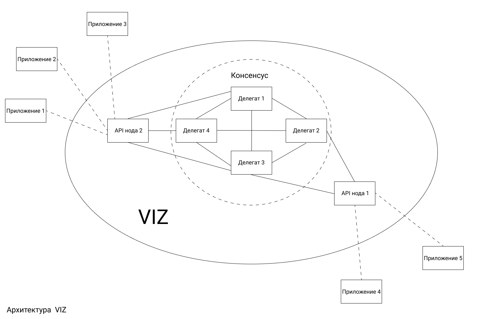

<!-- toc -->

## Что такое VIZ? {#what-is-viz}

VIZ – это блокчейн-платформа для социальных приложений, пользователи которых могут награждать друг друга токенами  из эмиссии (т.е. непрерывно «печатаемыми» блокчейном токенами) или их прямым переводом. За логику взаимодействий между пользователями отвечают приложения, блокчейн же обеспечивает проведение транзакций и надёжное неизменяемое хранение информации.

VIZ состоит из двух основных технических компонентов: базового консенсуса на основе Fair DPOS и интерфейса для работы с приложениями (API). Алгоритм консенсуса гарантирует, что одни и те же транзакции записываются в одинаковом порядке на всех нодах (компьютерах с установленным ПО блокчейна), а также обеспечивает базовые действия блокчейна: создание аккаунтов, распределение эмиссии, выплаты пользователям за их действия и некоторые другие. API представляет собой набор плагинов, которые написаны на языке C++, и доступ к этим плагинам через веб-интерфейсы.

## Чем VIZ отличается  от Ethereum, Bitcoin и других подобных проектов {#viz-vs-eth-vs-btc}

В отличие от многих криптопроектов вроде Ethereum или Bitcoin, в которых используются алгоритмы PoW или PoS, VIZ использует более демократичный алгоритм Fair DPOS. Это значит, что в сети главную роль играют не майнеры, а инвесторы, которые голосуют за создателей новых блоков – делегатов. Делегаты гарантируют стабильную работу блокчейна и получают за это выплаты из эмиссии. Однако система голосования устроена так, что владельцы большей доли сети имеют больший вес*. Кроме того, только 21 делегат (десять, получивших наибольшее количество голосов, и одиннадцать из остальных) имеет право создавать новые блоки и управлять параметрами сети.

## Чем VIZ отличается от BitShares {#viz-vs-bts}

VIZ, так же как BitShares, написан на основе Graphene. Оба проекта используют DPOS для подтверждения транзакций. Но BitShares задумывался как финансовая платформа, где можно создавать свои токены и торговать ими. В VIZ заложена иная идея – это платформа для социальных приложений.

# Чем VIZ отличается от Golos и Steem {#viz-vs-steem-vs-golos}

 Golos и Steem, так же как VIZ, созданы для социальных приложений. Однако два этих проекта задумывались как блог-платформы на блокчейне, где кураторы оценивают качество постов и решают, какую выплату получит автор. VIZ же позволяет получать награды за любые действия, даже за пределами блокчейна. Например, можно создать приложение, которое будет поощрять людей, заботящихся о пандах.

# Чем VIZ отличается от EOS {#viz-vs-eos}

EOS – блокчейн для децентрализованных приложений, который поддерживает смарт-контракты. Это своего рода операционная система, работающая на многих компьютерах одновременно. VIZ не поддерживает смарт-контракты, он только обеспечивает базовую механику, с помощью которой разработчики создают социальные приложения, где пользователи могут награждать друг друга. То есть VIZ больше подходит для централизованных решений или сторонних блокчейн-проектов, которые будут взаимодействовать с ним.

На EOS можно реализовать всё, что есть в VIZ. Главное отличие в том, что EOS-приложение хранит свой код на многих компьютерах и работает на них же. А приложение на базе VIZ использует блокчейн только как базу данных с механизмом наград за разные действия. Выбор между децентрализацией и централизацией зависит от целей приложений. Разработчик должен сам решить, что подойдёт именно его приложению.

# Кто владеет VIZ {#viz-owner}

У VIZ нет владельцев. Каждый участник сети, будучи обладателем её доли, сам решает, в каком направлении должен развиваться проект, и способствует этому развитию по мере сил и возможностей.

# Кто поддерживает код VIZ {#viz-code-support}

Код, на котором работает VIZ, распространяется под лицензией MIT. Это значит, что любой может копировать код, вносить изменения в копию и запускать собственные блокчейны. Изменения в код самого блокчейна VIZ предлагаются любыми разработчиками и принимаются или отклоняются делегатами.

# Кто запустил блокчейн VIZ {#who-launched-viz}

 Никто не знает, кем была запущена эта сеть.